# 👋 Hey, I'm Sarthak Goel!

**Full-Stack Engineer** — I build real-time, production-grade web and mobile applications with the **MERN stack**, **TypeScript**, and **React Native**. Big fan of systems that talk to each other live: **WebRTC**, **Socket.IO**, push notifications, and event-driven backends.

- 🚀 Shipped **[SancharTag](https://www.sanchartag.online/)** — a privacy-first vehicle contact platform used in the real world
- 🛠️ Building **[EazyPortfolio](https://www.eazyportfolio.com/)** — a portfolio & resume builder (my own portfolio [runs on it](https://portfolio.eazyportfolio.com/gsarthak783@gmail.com))
- 🌱 Currently leveling up on **DevOps**, **AWS deployments**, and **system design**

---

## 🚧 Featured Projects

| Project | What it is | Stack |
|---|---|---|
| 🚗 **[SancharTag](https://www.sanchartag.online/)**   [`server`](https://github.com/gsarthak783/SancharTag-server) · [`scanner`](https://github.com/gsarthak783/SancharTag-Scanner) | Scan a QR on any vehicle to **call or chat with the owner — phone numbers never exposed**. Anonymous WebRTC voice calls with Socket.IO signaling, OTP verification, session-based chat, and FCM push notifications. | React, Next.js, React Native, Node.js, Socket.IO, WebRTC |
| 📝 **[EazyPortfolio](https://www.eazyportfolio.com/)** | Build, customize, and share professional **portfolios & resumes** with multiple themes and visibility controls. | React, Tailwind CSS, Firebase Auth, MongoDB |
| 💼 **[CareerForge](https://career-forge-portal.vercel.app/)**   [`repo`](https://github.com/gsarthak783/Job-Portal) | A MERN job portal connecting employers and job seekers — JWT auth, RBAC, Redux Toolkit state management. | MERN, JWT, Redux Toolkit |
| 🎬 **MovieHub** *(in progress)*   [`app`](https://github.com/gsarthak783/movie-app) · [`server`](https://github.com/gsarthak783/movie-server) | A media streaming app with a Stremio-style **add-on architecture** and TMDB integration. | React, TypeScript, Node.js |

---

## 🛠️ Tech Stack

**Languages**

**Frontend**

**Backend & Real-Time**

**Databases**

**Cloud, DevOps & Automation**

---

## 📊 GitHub Stats

---

## 📫 Connect with Me

